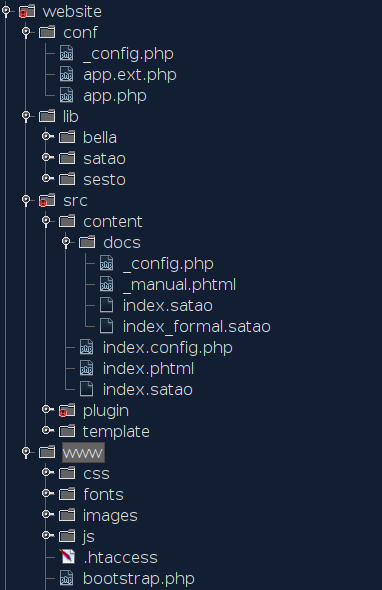

# assignment2-1122131 (alternative)

## Introduction

While it's a bit of a stereotype, there can be some truth to the idea that developers sometimes struggle with writing comprehensive documentation.
This isn't necessarily because developers are inherently "terrible" at it, but rather because:

* **Focus on Code:** Developers are primarily focused on writing code to solve problems and create functionality.
Documenting their code may not always be their top priority, especially if they're working on tight deadlines or under pressure to deliver results quickly.

* **Technical Expertise:** Developers often have deep technical knowledge, which can make it challenging for them to explain concepts in a way that's easily understandable to non-technical users.
They may inadvertently assume that others have the same level of understanding as they do, leading to documentation that's too technical or difficult to follow for beginners.

* **Time Constraints:** Documenting code and projects can be time-consuming, especially when developers are already busy with multiple tasks and deadlines.
As a result, they may prioritize coding over documentation in order to meet project deadlines.

* **Communication Skills:** Not all developers have strong writing or communication skills.
Documenting code effectively requires clear and concise writing, which may not be a strength for every developer.

However, it's important to note that many developers recognize the importance of documentation and strive to improve in this area.
There are tools like Javadoc or Doxygen to help developers create better documentation of their functions or classes.
Best practices like seeking feedback from users could improve the clarity and usefulness of documentation.
However there is a gap between "functions or classes" documentation and "algorythm" documentation.
When is time to document an algorythm and publish this on the web, there are two options available:

* use a content management system (CMS)
* use a cloud-based documentation service

A content management system (CMS) is a software application or set of related programs that are used to create and manage digital content.
A cloud-based documentation service, like Confluence or Google Docs, provides users with a platform to create, collaborate on, and manage documents, spreadsheets, presentations, and other types of content online.
Both systems users to create, edit, organize, and publish content such as text, images, videos, and other multimedia resources on a website.
They typically provide a user-friendly interface, often with features like WYSIWYG (What You See Is What You Get) editors, which allow users to format content similar to using a word processor.
They may include features for managing user permissions, version control, workflow management, and other tools to streamline the content creation and publishing process.

Both are good solutions but they represent a limit for developers with high skills in typing and utilizing keyboard shortcuts.
They possesses a combination of speed, accuracy, extensive shortcut knowledge, and a commitment to continuous learning.
These skills enable them to write and code more efficiently, navigate through codebases with ease, and streamline their development workflow.
This is true **only** when they are able to use their own preferred editor.
There are some questions?

* How to write HTML documentation for my own project?
* How to easily publish them on the web?

Satao and Bella CMS are going to answer these questions.


### What is Satao
Satao is a document format for publishing HTML documents.
Based on HTML, this markup language permits to write HTML document using a shorter version of HTML.

```
<figure>
  
  <figcaption>The elephant Satao</figcaption>
</figure>
```

Can be written as:

```
.figure<
.img{src="/images/satao.jpg" alt="The elephant Satao"}
.figcaption The elephant Satao<
```

The idea behind is to avoid to to learn another markup language syntax by using the potential of HTML in a less verbose manner.

### What is Bella CMS
Bella CMS is file-based CMS is a content management system where content is stored directly as files in the file system rather than in a database.
It utilizes a hierarchical directory structure to organize content, with each file representing a page or piece of content.
Users can create, edit, and manage content using a their preferred editor.
This approach offers simplicity, portability, and tracking using version control systems like Git.
File-based CMSs are lightweight, easy to set up, and well-suited for small to medium-sized websites or projects.

#### File organisation
In the old age of MS-DOS, Unix, or even of the web, users where able to organise their documents using good structure of directories (folders).
Bella CMS use the same concept




Files can be easily organised in directories (folders).
All the content is saved under `/src/content/` folder.
Would be necessary to create a file with extension `.satao` and then call the URL with the specific path.
On our example by calling the URL `https://satao.page/docs/` the CMS will try to load the file `index.satao`, then render it on HTML.

#### Different content processor
Bella CMS is quite flexible because is up to the user to decide what content processor use.
For example by adding the library Parsedown which is one of the most popular markdown libraries for PHP, the user can write all the content with Markdown.

